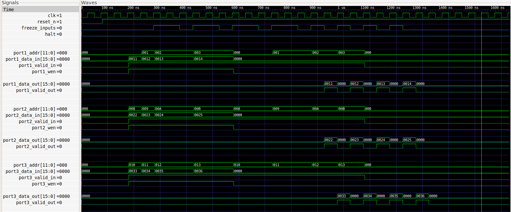
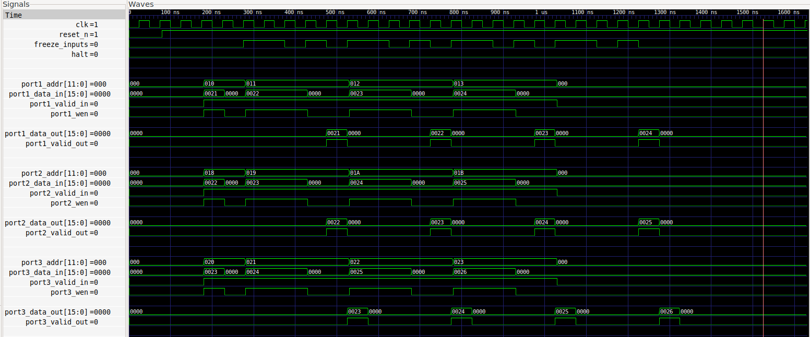
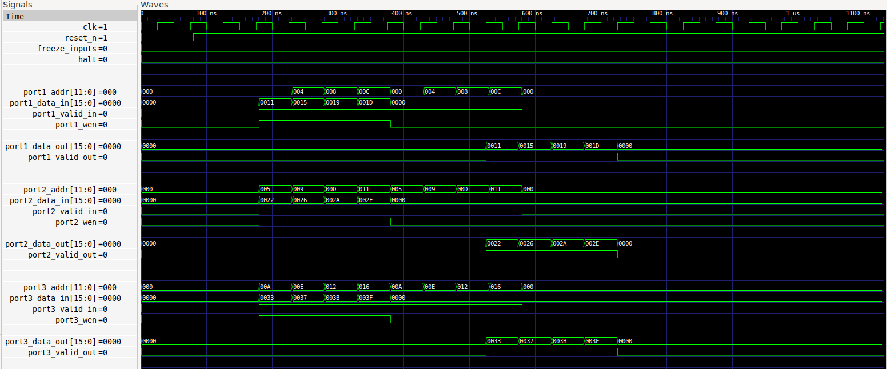
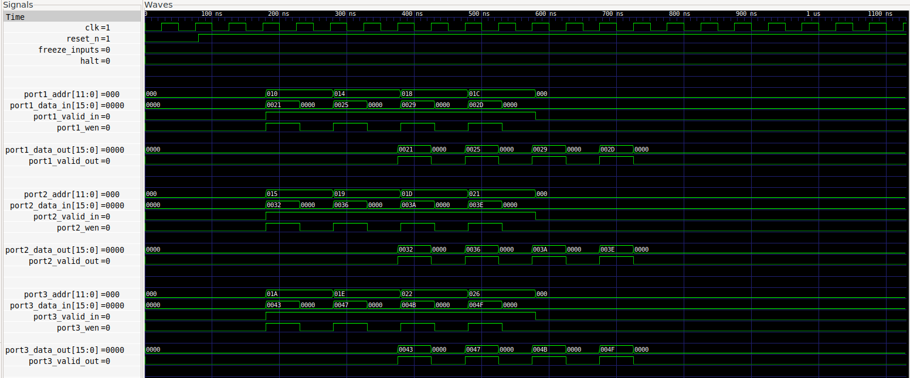
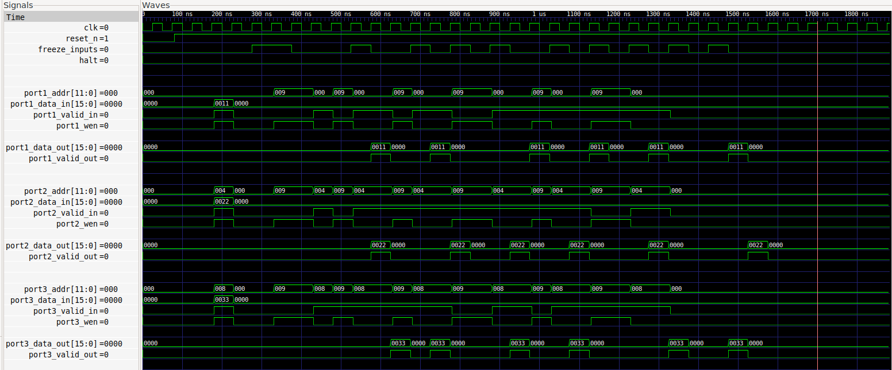
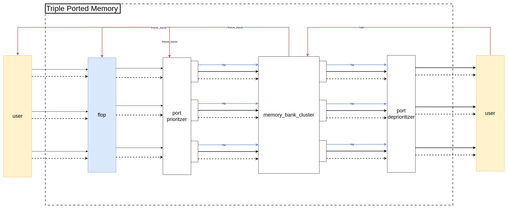
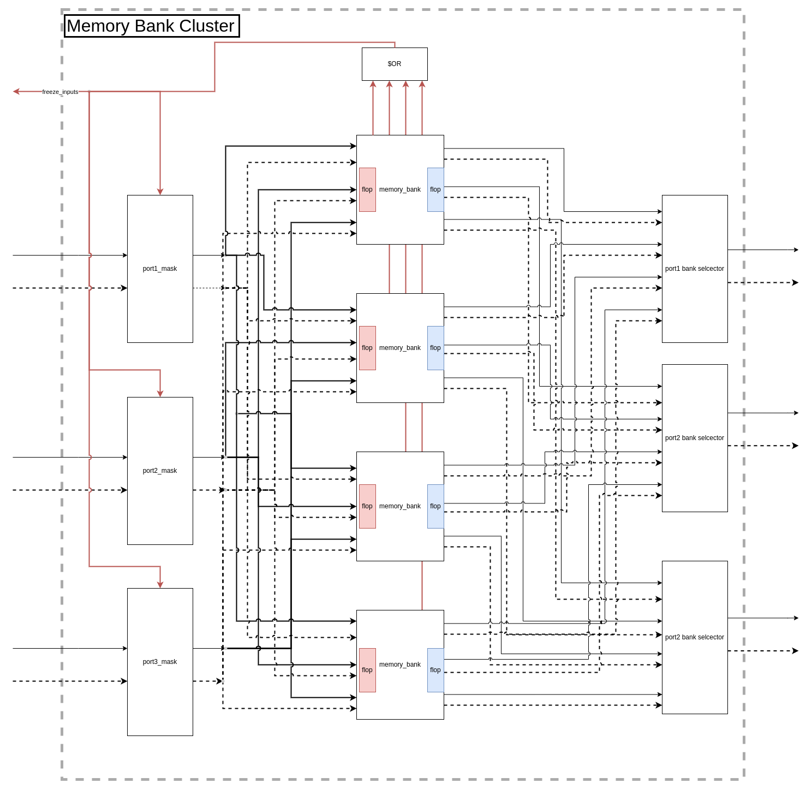
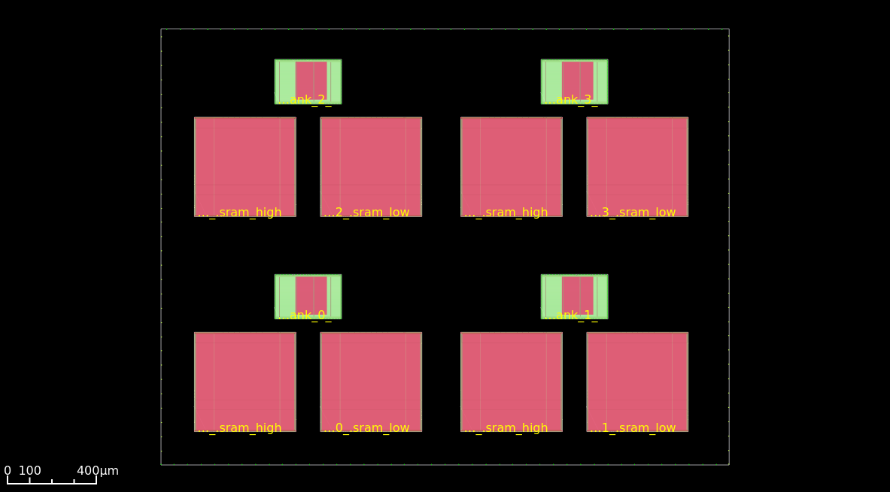
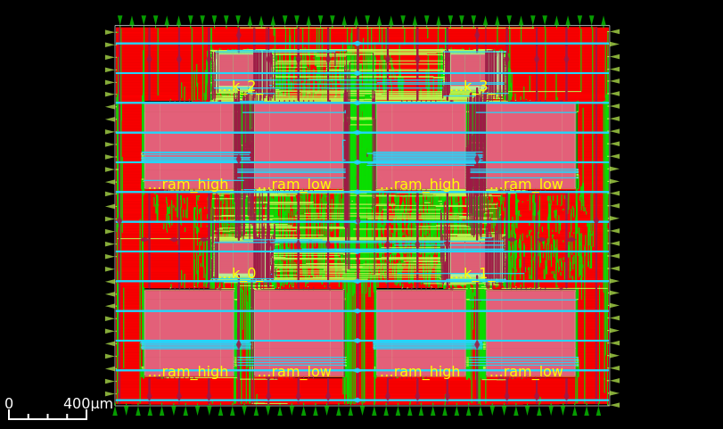
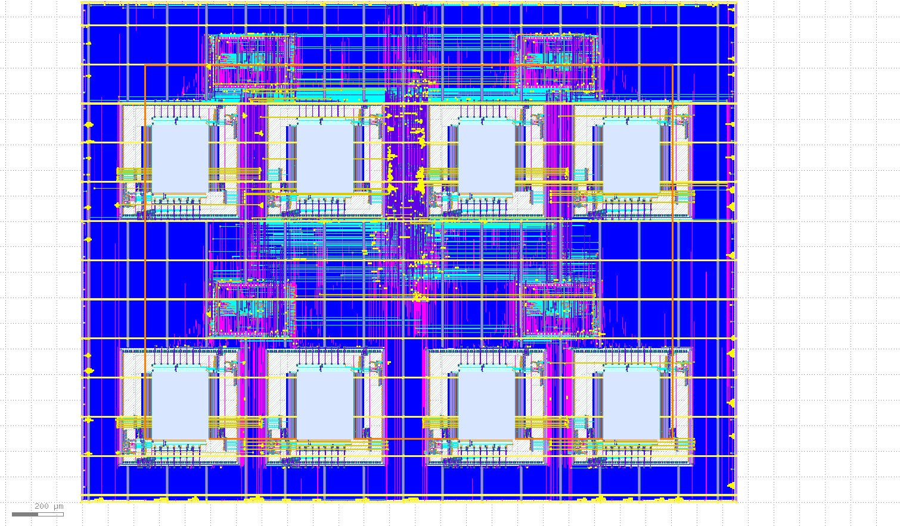

# Triple Ported Memory
Tripple Ported Memory is a pipelined multi-banked memory module with a dynamic-priority arbitration scheme to resolve bank conflicts. 

The memory module is composed of four banks. Each bank has 1024 words with a word size of 16 bits, giving the module a total capacity of 8KB. The memory is also interleaved such that contiguous memory addresses are shared across each bank in a round-robin manner. 

## Why Multi-banked Memory
Multi-banking is one of the techniques used to increase the number of ports of a memory module. Each port can potentially access different words of the memory simultaneously, thus providing access flexibility without incurring a performance loss when requests don't conflict. 

When different ports request access the same bank (a.k.a. a bank conflict), the requests must arbitrated and perhaps serialized. This module uses a dynamic arcbitration scheme to serialize conflicting accesses.

## How are Bank Conflicts Resolved
Bank conflicts are resolved using a dynamic priority scheme based on the frequency of memory requests from each port. The port that accesses the memory most frequently is served first. For read requests, the top two most frequent ports are served first.

## Top-level Interface
In addition to a clock (`clk`) and an active-low reset (`reset_n`) pin, each port contains the following:
- Input
    - A 12-bit address bus 
    - A 16-bit data bus
    - An active-high write enable pin
    - An active-high valid pin
- Output
    - A 16-bit data bus
    - An active-high valid pin

The reset pin is not used to initialize the memory array, but rather, it is used to initilize the sequential elements and pipeline flip-flops. 

The triple ported memory module can also be halted externally using the `halt` input pin. While halted, the outputs of the memory modules are frozen and so are the internal sequential elements. The `halt` port also gates the clock to the SRAMs and memory bank logic.

The memory module can also request that the elements driving its inputs be frozen using the `freeze_inputs` output pin. 

## Sample Use-Case Waveforms
All simulations were run using [Icarus Verilog](http://iverilog.icarus.com/)

### Coarse-grain Writes then Reads with Consecutive Bank Conflicts

Simulation Waveform showing coarse-grain writes then reads with bank conflicts on each write and read. Viewed using Gtkwave

The waveform shows that requests can be pipelined. When a bank conlict occurs, the `freeze_inputs` output signal is asserted, prompting the user (perhaps another device) to not change the inputs to the triple ported memory on the next rising edge of the clock. Once the conflicting requests are fulfilled, `freeze_inputs` deasserts, allowing the user the change the inputs to the triple ported memory on the next rising edge of the clock. The waveform also shows the default priority (port1 > port2 > port3) as seen in the staggered outputs on the `port#_data_out` ports. Port 1 and 2's data are returned before port 3's. This priority doesn't change since all ports access the memory with the same frequency.

### Fine-grain Writes then Reads with Consecutive Bank Conflicts

Simulation Waveform showing fine-grain writes then reads with bank conflicts on each write and read. Viewed using Gtkwave

### Coarse-grain Writes then Reads with No Bank Conflict

Simulation Waveform showing coarse-grain writes then reads without bank conflicts. Viewed using Gtkwave

Since no bank conflicts occur, all requests are handled simultaneously, leading to a lower overall latency.

### Fine-grain writes then reads with No Bank Conflict

Simulation Waveform showing fine-grain writes then reads without bank conflicts. Viewed using Gtkwave

### Demonstration of Dynamic Priority Arbitration

Waveform showing dynamic priority arbitration. Viewed using Gtkwave.

The waveform above shows that as the access fequency of each port changes (by controlling when `port#_valid_in` is asserted) so does the priority of with which each port's request is handled. The waveform cycles through all six possible priority scenarios: (123->312->321->231->213->132). It appears that there are only three unique scenarios since the memory module is can execute two reads simultaneous even when the requests cause a bank conflict. 

## Architecture
Overview of the modules architecture. Please bear in mind that numerous singals for the sake of simplicity.
### Top-level

Top-level architecture of the Triple Ported Memory

Dashed line represents `valid` signals while other signals a represented using the solid arrow.

### Memory Bank Cluster

Memory Bank Cluster architecture with SRAMs not shown

## OpenLane Physical Implementation
The physical design for this memory modules was performed using [OpenLane](https://github.com/The-OpenROAD-Project/OpenLane) RTL-to-GDSII flow on SKY130 PDK. A hierarchical design methodology was employed with two macros:

- Memory Bank Logic (hardened)
- SKY130 SRAM macro (sky130_sram_1kbyte_1rw1r_8x1024_8)

Due to computing resource constraints, the DRC stages of the OpenLane flow could not be executed. There are also a some issues regarding the extracted timing models for the hardened macros.

### **Final Design Metrics**:
- **Die Area**: 4.998 mm2
- **Core Area**: 4.9166 mm2
- **Frequency**: 25 MHz
- **Core Utilization**: 43%

Please note that rigorous design exploration has NOT been conducted.

### **Floorplan**:

Floorplan showing sram macros and memory bank logic macros. Viewed using OpenROAD gui

The eight larger blocks are the SKY130 sram macros. Two SRAM macros are are needed to provide a 16-bit word size for each bank. The four smaller blocks are the hardnend memory bank logic macros.
  
 

### **Routed Design**

Fully Routed Design in OpenROAD Gui

### **Final GDS** 

Final GDS rendered in Klayout

### OpenLane Learnings
After spending many hours fighting with the OpenLane RTL-to-GDS flow, I thought it best to share my findings and workarounds.

